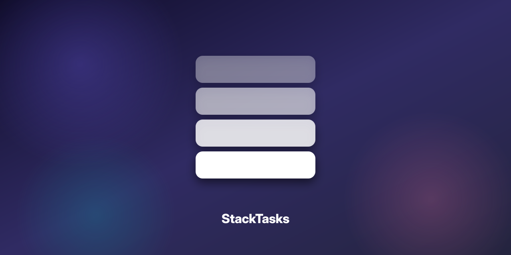

# StackTasks

A stack-based task app for ADHD brains. Tap the top card to focus, swipe to
dismiss or cycle, long-press + drag to reorder.

## Tech

- Flutter (mobile, desktop planned)
- MVVM with `provider` and per-widget `ChangeNotifier` controllers
- SQLite with append-only `task_changes` table for future sync

## Project structure

- `stacktask_mobile/` — Flutter package
  - `lib/src/core/` — models, database, repository, service, result
  - `lib/src/ui/` — viewmodels, screens, widgets
- `stacktask_mobile/assets/` — brand SVGs and PNGs (registered in `pubspec.yaml`)
- `stacktask_mobile/android/app/src/main/res/mipmap-*/` — Android launcher icons

## Screenshots

- [`stack-task.png`](./stack-task.png) — original design mockup
- [`stacktask_mobile/assets/hero.png`](./stacktask_mobile/assets/hero.png) — current brand hero

## Brand assets

| File | Use |
|---|---|
| `stacktask_mobile/assets/logo.svg` | Vector logo (any size) |
| `stacktask_mobile/assets/logo.png` | 256×256 raster |
| `stacktask_mobile/assets/logo@512.png` | 512×512 hi-DPI |
| `stacktask_mobile/assets/icon-stack.svg` | Small mark, favicons, badges |
| `stacktask_mobile/assets/icon-stack.png` | 64×64 raster of the mark |
| `stacktask_mobile/assets/hero.svg` | Vector hero banner |
| `stacktask_mobile/assets/hero.png` | 1280×640 raster hero |
| `stacktask_mobile/android/app/src/main/res/mipmap-*/ic_launcher.png` | Android launcher, 5 DPIs |
| `stacktask_mobile/android/app/src/main/res/mipmap-*/ic_launcher_round.png` | Round variant, 5 DPIs |
| `stacktask_mobile/android/app/src/main/res/mipmap-*/ic_launcher_foreground.png` | Adaptive icon foreground, 5 DPIs |
| `stacktask_mobile/android/app/src/main/res/mipmap-anydpi-v26/ic_launcher.xml` | Adaptive icon descriptor |

## Run

    cd stacktask_mobile
    flutter pub get
    flutter run
